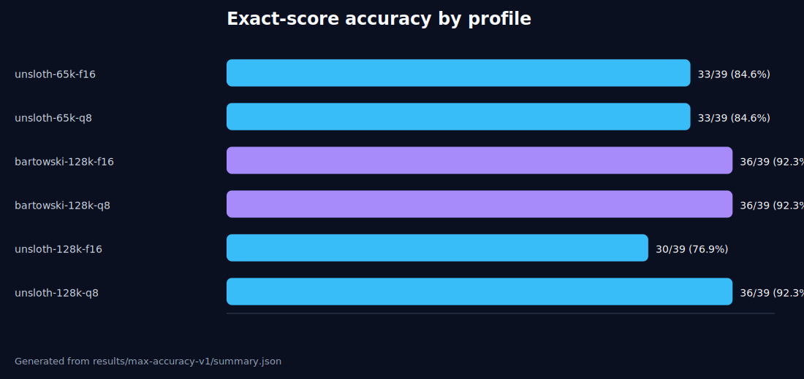
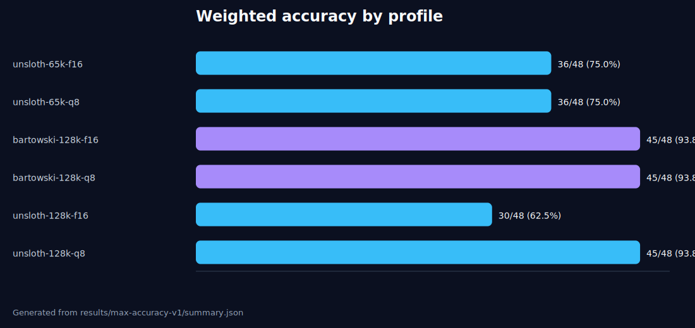
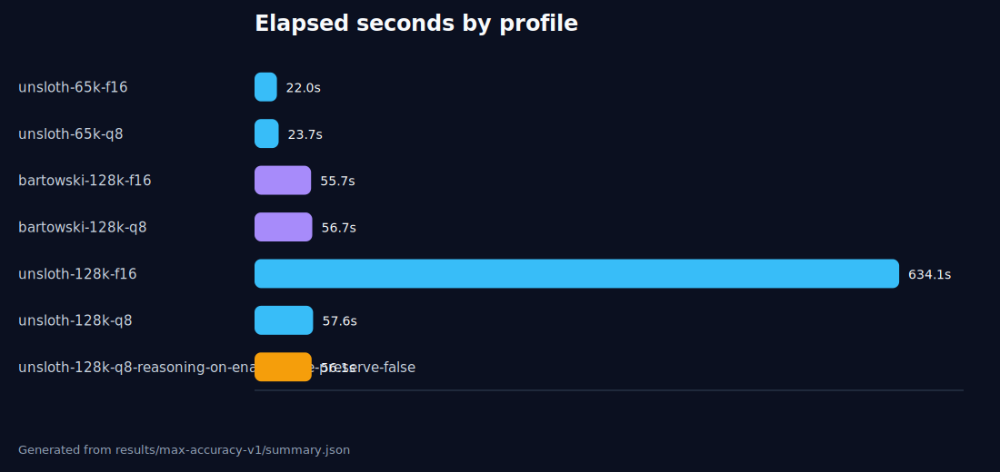
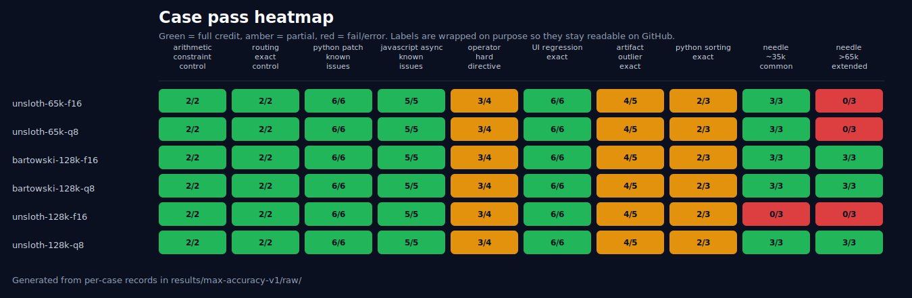

# Results

Canonical machine-readable summaries:

- `results/max-accuracy-v1/summary.csv`
- `results/max-accuracy-v1/summary.json`
- `results/max-accuracy-v1/combined-max-accuracy-20260504.md`

## Max-accuracy summary

| Profile | Exact | Weighted | Errors | Elapsed | Short/code/UI | Common needle | Extended >65k needle |
|---|---:|---:|---:|---:|---:|---:|---:|
| `unsloth-65k-f16` | 33/39 | 36/48 | 1 | 22.0s | 30/33 | 3/3 | 0/3 |
| `unsloth-65k-q8` | 33/39 | 36/48 | 1 | 23.7s | 30/33 | 3/3 | 0/3 |
| `bartowski-128k-f16` | 36/39 | 45/48 | 0 | 55.7s | 30/33 | 3/3 | 3/3 |
| `bartowski-128k-q8` | 36/39 | 45/48 | 0 | 56.7s | 30/33 | 3/3 | 3/3 |
| `unsloth-128k-f16` | 30/39 | 30/48 | 2 | 634.1s* | 30/33 | 0/3 | 0/3 |
| `unsloth-128k-q8` | 36/39 | 45/48 | 0 | 57.6s | 30/33 | 3/3 | 3/3 |

\* Loaded, then timed out on both long-context prompts under local memory/throughput pressure. The elapsed value includes those timeouts and should not be treated as completed throughput.

## Visuals









## Raw results

Raw API responses and per-case scoring records are included under:

```text
results/max-accuracy-v1/raw/
results/sidecar-profile-evals-v1/raw/
```
